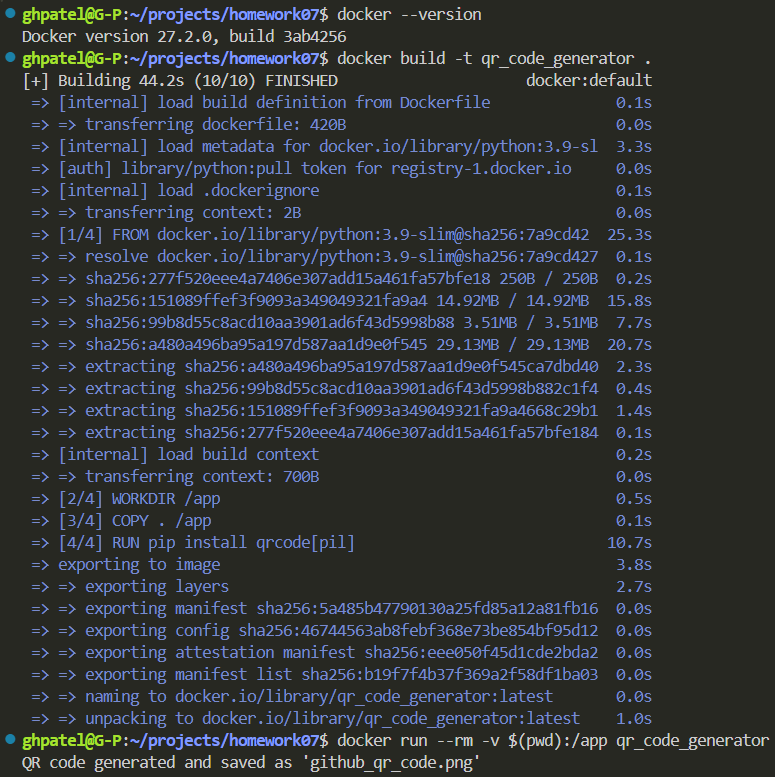

# Instructions
1. Goto Docker.com and Install docker
2. Signup for your own Docker account

## QR Code
QR code image that links to my own GitHub homepage that I generate:

## QR Code Generation Log
An image of viewing the log of successfully creating the QR code:

